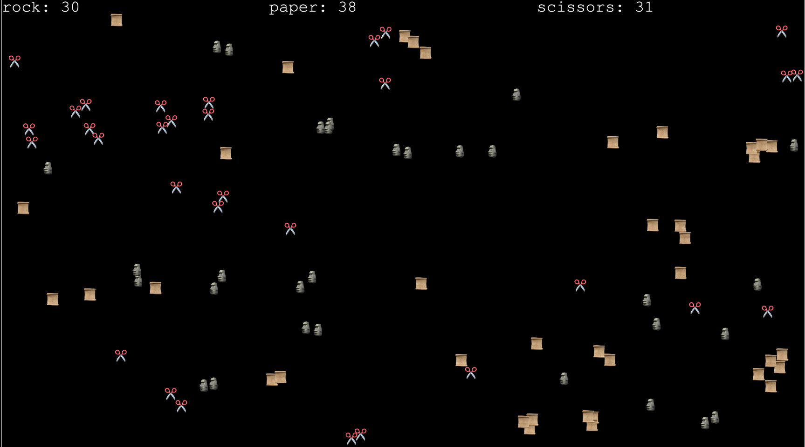

# RPS Tournament

Tried to make a "Rock Paper Scissors" simulator! Saw something of this kind on Instagram reels (I know :disappointed:) and thought that its a very simple but fun idea, maybe even I can build it. I have been wanting to try a small one day build kinda project with using AI and see how it turns out. Overall the result seems fun to me!

This repo has all the code needed for the static website. There are a lot more things that can be added but for now closing at this MVP. Took about 2 hpurs to build with help from Google Gemini. To be honest the AI was not at the level I hoped it to be (Maybe since I tried the free version?) but still helpful, especially when you are very new to the technology. I have 0 knowledge of phaser (it was one of the options suggested by Gemini), also game dev in general and am a noob in JS. But still a few boiler plate code, some help from stackoverflow and phaser forums and some trial and error, we are here!

Hosting the game via Github Pages [here](keivan-shah.github.io/RPS)!

Acknowledgements:
- [Google Gemini](https://blog.google/technology/ai/google-gemini-ai/)
- [Phaser](https://github.com/phaserjs/phaser)
- For sprites: (Emoji to PNG)[https://emoji.aranja.com/]
